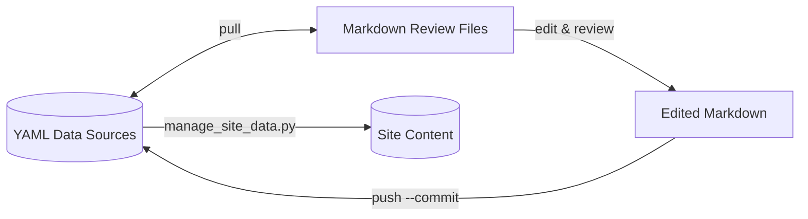
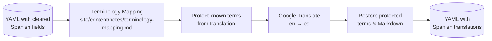
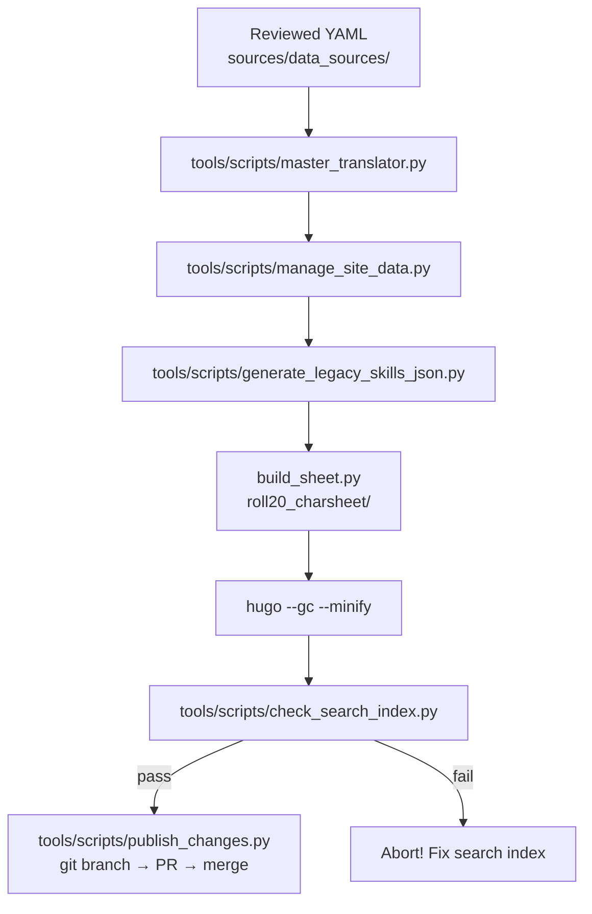
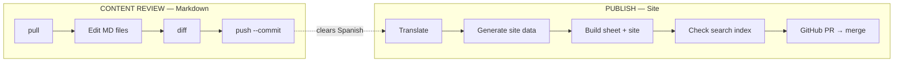

# Pipeline & Workflow Guide

## Overview

This project has **one source of truth** and **two pipelines**.

```
One Source of Truth ──→ YAML data sources (sources/data_sources/*.yaml)
                          │
        ┌─────────────────┼──────────────────┐
        ▼                                     ▼
  Review Pipeline                     Publish Pipeline
  (YAML ↔ Markdown)                   (YAML → Site)
```

---

## Pipeline A: Content Review

**Purpose**: Edit content safely in Markdown — low token cost, clean diffs, no AI hallucination risk on YAML.

**Direction**: Bidirectional (YAML ↔ Markdown)

**Tool**: `tools/data_manager.py` — invoked via the `data-manager` shim (run with `skill`, `psionics`, `gear`, `armor`, `weapons`, `goods`, `services`, `computers`, or `cybernetics` subcommand)



### Workflow

```bash
# Via installed shim (~/.local/bin/data-manager)
data-manager skill pull --overwrite     # YAML → Markdown (create review files)
  → edit Markdown in sources/skills/<skill>/
data-manager skill diff -v              # Compare Markdown vs YAML
data-manager skill push --commit        # Markdown → YAML (clear Spanish on change)

# Or directly with pipenv
pipenv run python3 tools/data_manager.py skill pull --overwrite
pipenv run python3 tools/data_manager.py skill diff -v
pipenv run python3 tools/data_manager.py skill push --commit
```

### Manager Commands

| Command | Direction | Description |
|---------|-----------|-------------|
| `pull --overwrite` | YAML → Markdown | Generate fresh review files from YAML |
| `diff -v` | Compare | Show what's changed between Markdown and YAML |
| `push --commit` | Markdown → YAML | Apply approved edits; clears Spanish to trigger re-translation |
| `push` (no flag) | Dry run | Preview changes without writing |

### Review Directories

| Domain | Command | YAML Source | Review Directory |
|--------|---------|-------------|------------------|
| Domain | Command | YAML Source | Review Directory |
|--------|---------|-------------|------------------|
| Skill | `data-manager skill ...` | `sources/data_sources/skills.yaml` | `sources/skills/` (34 broad skills) |
| Psionics | `data-manager psionics ...` | `sources/data_sources/psionics.yaml` | `sources/psionics/` (5 disciplines) |
| Weapons | `data-manager weapons ...` | `sources/data_sources/weapons.yaml` | `sources/weapons/` (melee + ranged × 9 PL categories) |
| Armor | `data-manager armor ...` | `sources/data_sources/armor.yaml` | `sources/armor/` (9 PL categories) |
| Gear | `data-manager gear ...` | `sources/data_sources/survival_gear.yaml` | `sources/survival-gear/` |
| Goods | `data-manager goods ...` | `sources/data_sources/goods_and_services.yaml` | `sources/goods/` (6 categories) |
| Services | `data-manager services ...` | `sources/data_sources/goods_and_services.yaml` | `sources/services/` |
| Computers | `data-manager computers ...` | `sources/data_sources/computers.yaml` | `sources/computers/` |
| Cybernetics | `data-manager cybernetics ...` | `sources/data_sources/cybernetics.yaml` | `sources/cybernetics/` (2 PL levels) |

### File Format

Each review file is Markdown with YAML frontmatter:

```markdown
---
name: Acrobatics
attribute: DEX
category: Combat
url: /skills/acrobatics/
---
Description text goes here...
```

- `_<skill>.md` — Broad skill entry
- `<specialty>.md` — Individual specialty

---

## Pipeline B: Translation

**Purpose**: Automatically translate English content to Spanish, respecting canonical terminology.

**Script**: `tools/scripts/master_translator.py` (invoked via `master-translator` shim or `pipenv run python3 tools/scripts/master_translator.py`)

**Source of truth**: `site/content/notes/terminology-mapping.md`



### When Translation Happens

The translator only acts when Spanish fields are **empty** or **significantly shorter** than English:

```python
if not current_es_desc or len(current_es_desc) < len(en_desc) * 0.8:
    # translate this field
```

This means:
- Run after `push --commit` (which clears Spanish descriptions)
- Run on first import of new content
- Use `--force` flag to force re-translate everything

### Terminology Mapping

The file `site/content/notes/terminology-mapping.md` is a Markdown table:

```markdown
| English | Spanish |
|---------|---------|
| Skill   | Habilidad |
| Check   | Tirada   |
| Ordinary| Ordinario|
```

The translator **protects** these terms during translation so they appear exactly as specified, then restores them after Google Translate finishes.

---

## Pipeline C: Publish

**Purpose**: Take reviewed YAML → generate site content → translate → build → deploy.

**Script**: `tools/publish.sh` (invoked via `publish` shim or `bash tools/publish.sh`)



### Publish Steps

```
1. `master-translator`           # Translate empty/outdated Spanish fields
2. `manage-site-data`            # Generate JSON + Hugo content from YAML
3. `generate-legacy-skills`      # Legacy Roll20 index
4. `cd roll20_charsheet && python3 build_sheet.py && cd ..`  # Build Roll20 character sheet HTML
5. `cd site && hugo --gc --minify && cd ..`  # Build static site
6. `check-search-index`          # Verify key content in search (aborts on failure)
7. `publish`                      # Create branch → PR → auto-merge to main
```

### What `manage_site_data.py` Generates

| Source YAML | Outputs |
|-------------|---------|
| `skills.yaml` | `site/content/skills/` Markdown pages + JSON tables |
| `psionics.yaml` | `site/content/psionics/` Markdown pages + JSON tables + search index |
| `armor.yaml` | `site/data/` localized JSON |
| `weapons.yaml` | `site/data/` localized JSON |
| `computers.yaml` | `site/data/` localized JSON |
| `cybernetics.yaml` | `site/data/` localized JSON |
| `goods_and_services.yaml` | `site/data/` localized JSON |
| `survival_gear.yaml` | `site/data/` localized JSON |
| `perks.yaml` + `flaws.yaml` | `site/content/perks_flaws/` + JSON tables |
| `backgrounds.yaml` | `site/content/backgrounds/` + JSON tables |

---

## Full End-to-End Workflow



### Typical Session

```bash
# 0. Install shims (one-time)
cd tools && make install && cd ..

# 1. Pull latest YAML to Markdown for review
data-manager skill pull --overwrite
data-manager weapons pull --overwrite
data-manager armor pull --overwrite
data-manager goods pull --overwrite
data-manager computers pull --overwrite
data-manager cybernetics pull --overwrite

# 2. Edit Markdown files in sources/<domain>/<category>/

# 3. Check what changed
data-manager skill diff -v
data-manager weapons diff -v
data-manager armor diff -v
data-manager goods diff -v
data-manager computers diff -v
data-manager cybernetics diff -v

# 4. Push approved changes (clears Spanish → triggers re-translate)
data-manager skill push --commit
data-manager weapons push --commit
data-manager armor push --commit
data-manager goods push --commit
data-manager computers push --commit
data-manager cybernetics push --commit

# 5. Translate + publish
publish
```

---

## File Inventory

### Unified Manager (the new standard)

| File | Purpose |
|------|---------|
| `tools/data_manager.py` | Single script for all 9 domains, invoked via `data-manager` shim |

### Pipeline Scripts (tools/scripts/)

| Script | Shim | Purpose |
|--------|------|---------|
| `manage_site_data.py` | `manage-site-data` | YAML → Hugo content (JSON + Markdown pages) |
| `master_translator.py` | `master-translator` | English → Spanish via Google Translate + terminology map |
| `generate_legacy_skills_json.py` | `generate-legacy-skills` | Generates JSON that Roll20 character sheet macros use to build skill wiki links |
| `check_search_index.py` | `check-search-index` | Canary: verifies key content in search index before publish |
| `publish_changes.py` | (part of `publish`) | Git branch → PR → merge automation |
| `data_linter.py` | — | Validate YAML schema and formatting |
| `data_formatter.py` | — | Auto-format YAML files |
| `validate_data_sources.py` | — | Validate YAML structure |

### Data Sources (sources/data_sources/)

| File | Content |
|------|---------|
| `skills.yaml` | 34 broad skills with specialties |
| `psionics.yaml` | 5 psionic disciplines with powers |
| `weapons.yaml` | Ranged + melee weapons |
| `armor.yaml` | Armor + shields |
| `computers.yaml` | Computer equipment |
| `cybernetics.yaml` | Cybernetic enhancements |
| `goods_and_services.yaml` | General goods |
| `survival_gear.yaml` | Survival equipment |
| `perks.yaml` | Character perks |
| `flaws.yaml` | Character flaws |
| `backgrounds.yaml` | Character backgrounds |

### Key Configuration

| File | Purpose |
|------|---------|
| `.project_root` | Empty marker file — manager scripts detect project root by walking up until they find this |
| `site/hugo.toml` | Hugo site configuration (bilingual: en + es) |
| `netlify.toml` | Netlify deploy config (Hugo v0.123.0) |
| `site/content/notes/terminology-mapping.md` | Canonical English→Spanish term translations |
| `publish.sh` | Orchestrates full publish pipeline (invoked via `publish` shim) |
| `tools/Makefile` | Build & install shims to `~/.local/bin` (`cd tools && make install`) |
| `.gitignore` | Ignores build artifacts, backups |

---

## Key Design Rules

1. **YAML is the source of truth** — everything else is derived
2. **Review in Markdown** — lower token cost, cleaner diffs, safer from AI hallucination
3. **`push --commit` clears Spanish** — signals the translator to regenerate
4. **Translator protects canonical terms** — terminology mapping takes priority over Google Translate
5. **Search index is the quality gate** — `check_search_index.py` aborts publish if key content is missing
